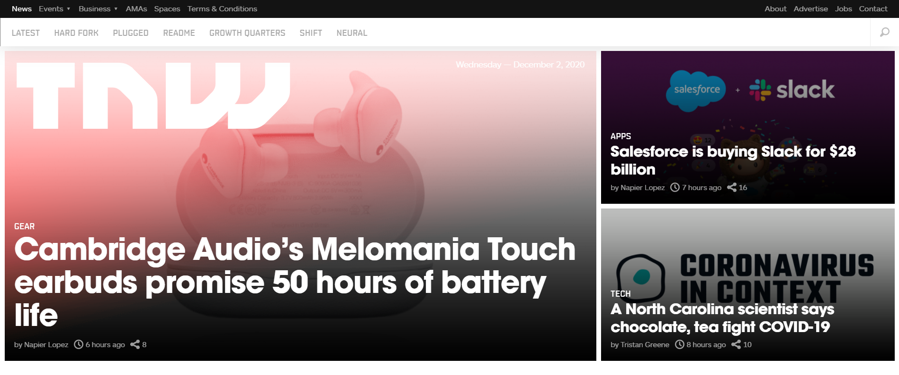

# Building Responsive websites with HTML, CSS and Media Queries

> Her we built a clone of The Next Web's website using HTML, CSS and Media Queries. We built it with the mobile first approach and then scaled it for tablets and desktop. 

Additional description about the project and its features.

## Built With

- Major languages -- HTML and CSS
- Frameworks - None
- Technologies used - HTML, CSS and Media Query

## Live Demo

[Live Link](https://chrystalme.github.io/tnw-clone-project/)

To get a local copy up and running follow these simple example steps.

### Prerequisites

- You only need a web browser connected to the internet to run this website

### Setup

- No special set up needed. Just follow the live link provided

## Authors

👤 **Author1**

- GitHub: [@chrystalme](https://github.com/chrystalme)
- Twitter: [@afam_chrys](https://twitter.com/afam_chrys)
- LinkedIn: [Afam Ifeanyi (chrys) Malieze](https://linkedin.com/in/afam-ifeanyi-chrys-malieze-63876576)
👤 **Author2**

- GitHub: [@githubhandle](https://github.com/sohaibya)
- LinkedIn: [LinkedIn](https://linkedin.com/linkedinhandle)

## 🤝 Contributing

Contributions, issues, and feature requests are welcome!

Feel free to check the [issues page](issues/).

## Show your support

Give a ⭐️ if you like this project!

## Acknowledgments

- Microverse
- The Ordin Project

## 📝 License

This project is [MIT](lic.url) licensed.
